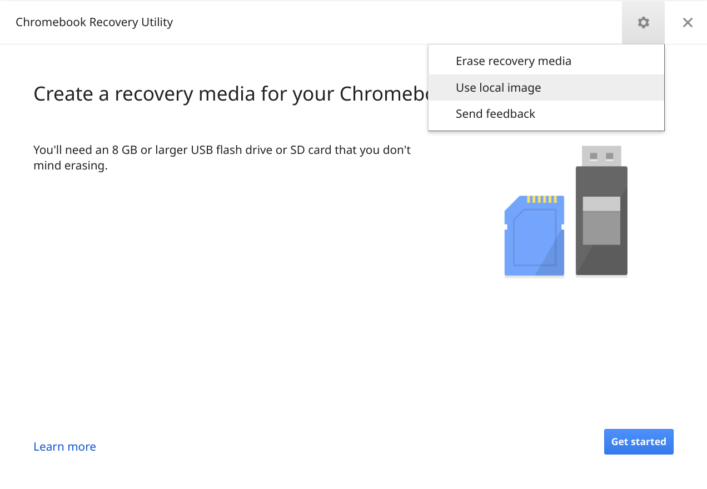
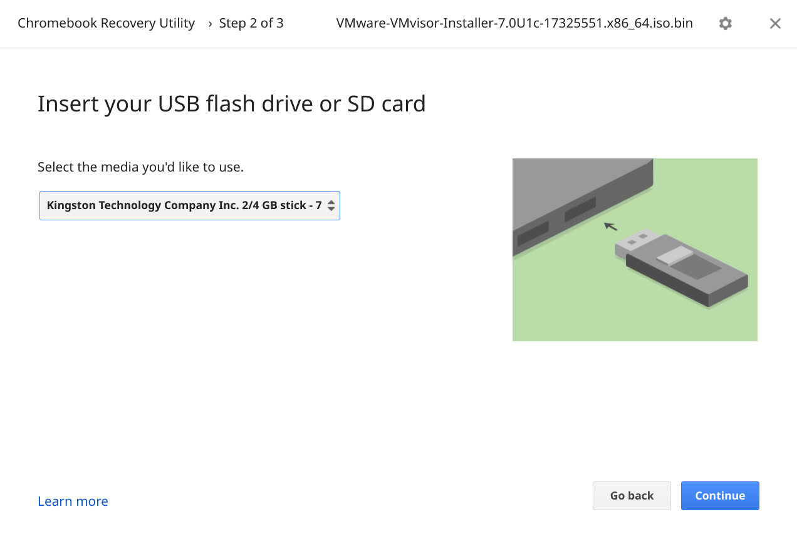
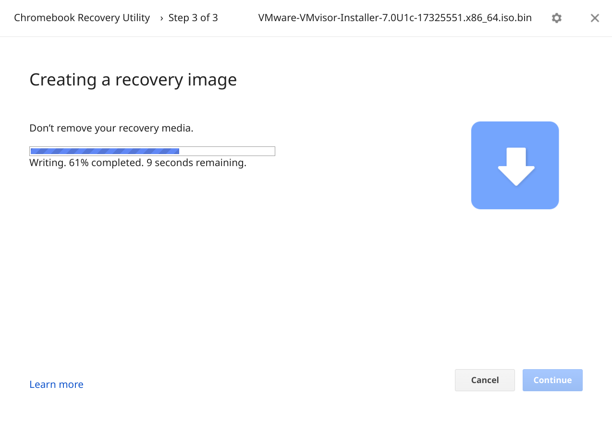
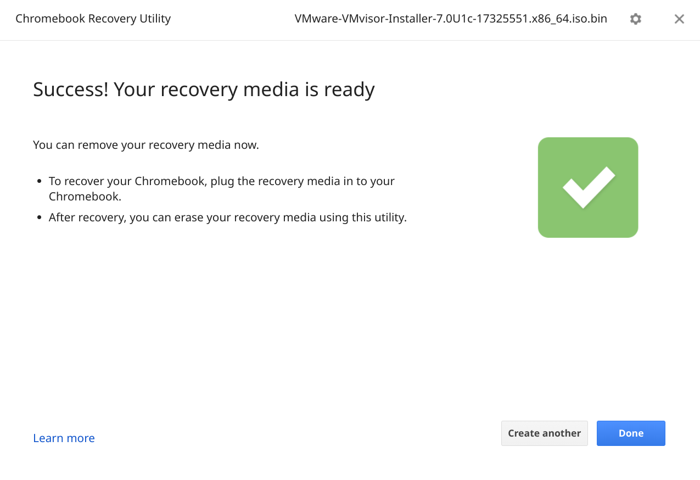

There are a number of fantastic Windows applications for creating bootable USB drives from ISO images - but those don't work on a Chromebook. Fortunately there's an easily-available tool which will do the trick: Google's own [Chromebook Recovery Utility](https://chrome.google.com/webstore/detail/chromebook-recovery-utili/pocpnlppkickgojjlmhdmidojbmbodfm) app. 

Normally that tool is used to creating bootable media to [reinstall Chrome OS on a broken Chromebook](https://support.google.com/chromebook/answer/1080595) (hence the name) but it also has the capability to write other arbitrary images as well. So if you find yourself needing to create a USB drive for installing ESXi on a computer in your [home lab](https://twitter.com/johndotbowdre/status/1341767090945077248) (more on that soon!) here's what you'll need to do:

1. Install the [Chromebook Recovery Utility](https://chrome.google.com/webstore/detail/chromebook-recovery-utili/pocpnlppkickgojjlmhdmidojbmbodfm).
2. Download the ISO you intend to use.
3. Rename the file to append `.bin` on the end, after the `.iso` bit:
 
4. Plug in the USB drive you're going to sacrifice for this effort - remember that ALL data on the drive will be erased.
5. Open the recovery utility, click on the gear icon at the top right, and select the *Use local image* option:

6. Browse to and select the `*.iso.bin` file.
7. Choose the USB drive, and click *Continue*.

8. Click *Create now* to start the writing!

9. All done! It probably won't work great for actually recovering your Chromebook but will do wonders for installing ESXi (or whatever) on another computer!

You can also use the CRU to make a bootable USB from a `.zip` archive containing a single `.img` file, such as those commonly used to distribute [Raspberry Pi images](https://www.raspberrypi.org/documentation/installation/installing-images/chromeos.md).

Very cool!
