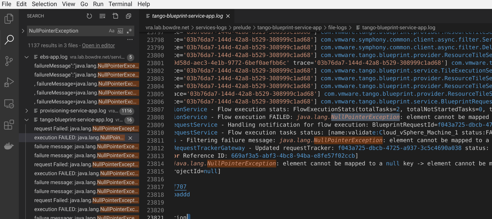
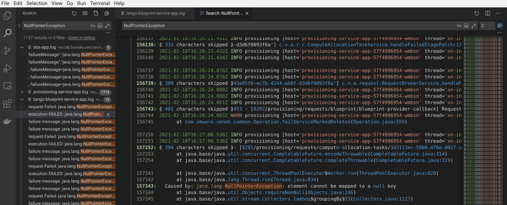

I recently ran into a peculiar issue after upgrading my vRealize Automation homelab to the new 8.3 release, and the error message displayed in the UI didn't give me a whole lot of information to work with:

I connected to the vRA appliance to try to find the relevant log excerpt, but [doing so isn't all that straightforward](https://www.stevenbright.com/2020/01/vmware-vrealize-automation-8-0-logs/#:~:text=Access%20Logs%20from%20the%20CLI) given the containerized nature of the services.
So instead I used the `vracli log-bundle` command to generate a bundle of all relevant logs, and I then transferred the resulting (2.2GB!) `log-bundle.tar` to my workstation for further investigation. I expanded the tar and ran `tree -P '*.log'` to get a quick idea of what I've got to deal with:

Ugh. Even if I knew which logs I wanted to look at (and I don't) it would take ages to dig through all of this. There's got to be a better way.

And there is! Visual Studio Code lets you open an entire directory tree in the editor:

You can then "Find in Files" with `Ctrl`+`Shift`+`F`, and VS Code will *very* quickly search through all the files to find what you're looking for:

You can also click the "Open in editor" link at the top of the search results to open the matching snippets  in a single view:

Adjusting the number at the far top right of that view will dynamically tweak how many context lines are included with each line containing the search term.

In this case, the logs didn't actually tell me what was going wrong  - but I felt much better for having explored them! Maybe this little trick will help you track down what's ailing you.