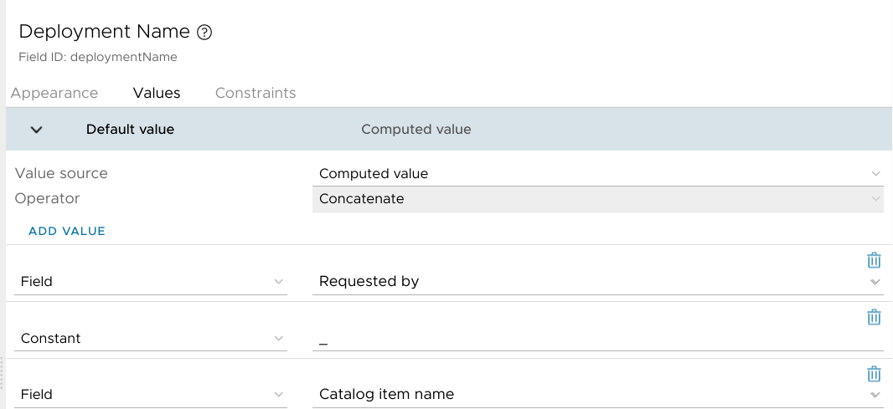
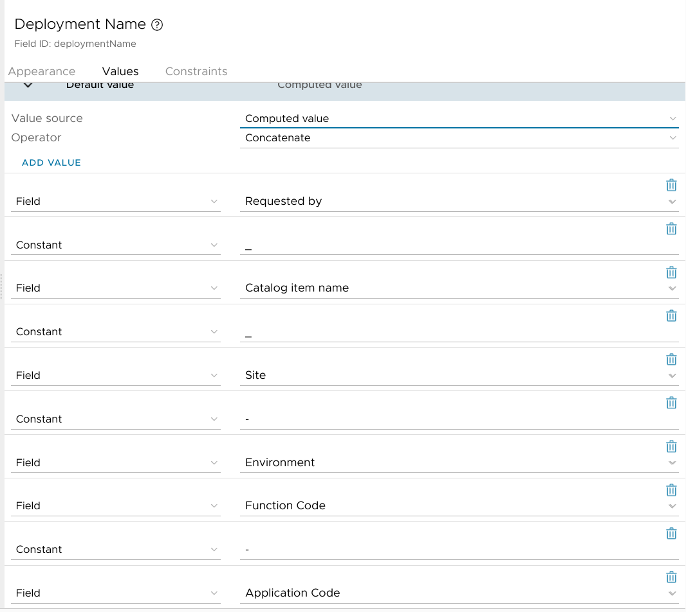
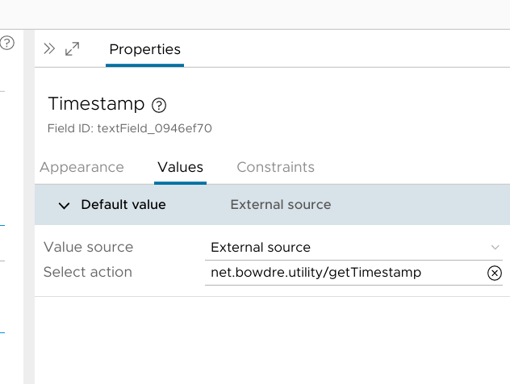
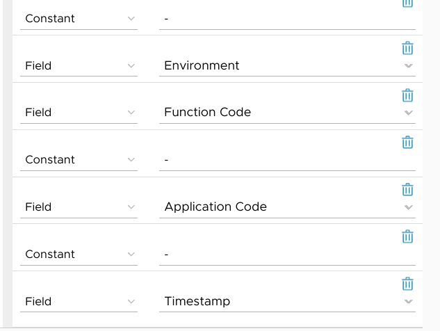
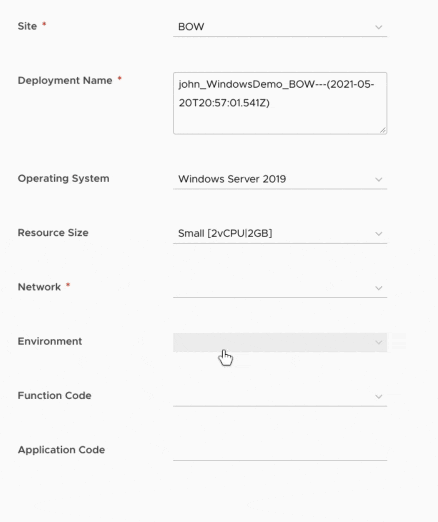
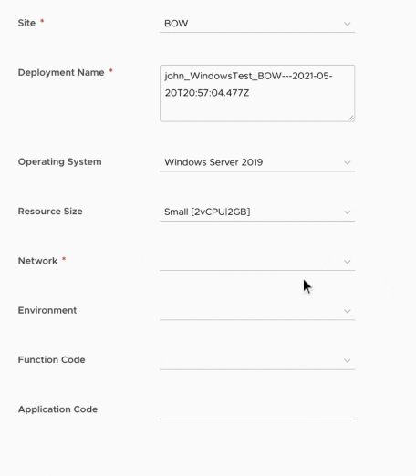

A [few days ago](/vra8-custom-provisioning-part-four#automatic-deployment-naming), I shared how I combined a Service Broker Custom Form with a vRO action to automatically generate a unique and descriptive deployment name based on user inputs. That approach works *fine* but while testing some other components I realized that calling that action each time a user makes a selection isn't necessarily ideal. After a bit of experimentation, I settled on what I believe to be a better solution.

Instead of setting the "Deployment Name" field to use an External Source (vRO), I'm going to configure it to use a Computed Value. This is a bit less flexible, but all the magic happens right there in the form without having to make an expensive vRO call.


After setting `Value source` to `Computed value`, I also set the `Operation` to `Concatenate` (since it is, after all, the only operation choice. I can then use the **Add Value** button to add some fields. Each can be either a *Constant* (like a separator) or linked to a *Field* on the request form. By combining those, I can basically reconstruct the same arrangement that I was previously generating with vRO:


So this will generate a name that looks something like `[user]_[catalog_item]_[site]-[env][function]-[app]`, all without having to call vRO! That gets me pretty close to what I want... but there's always the chance that the generated name won't be truly unique. Being able to append a timestamp on to the end would be a big help here.

That does mean that I'll need to add another vRO call, but I can set this up so that it only gets triggered once, when the form loads, instead of refreshing each time the inputs change.

So I hop over to vRO and create a new action, which I call `getTimestamp`. It doesn't require any inputs, and returns a single string. Here's the code:
```js
//  JavaScript: getTimestamp action
//    Inputs: None
//    Returns: result (String)

var date = new Date();
var result = date.toISOString();
return result
```

I then drag a Text Field called `Timestamp` onto the Service Broker Custom Form canvas, and set it to not be visible:


And I set it to pull its value from my new `net.bowdre.utility/getTimestamp` action:


Now when the form loads, this field will store a timestamp with thousandths-of-a-second precision.

The last step is to return to the Deployment Name field and link in the new Timestamp field so that it will get tacked on to the end of the generated name.


The old way looked like this, where it had to churn a bit after each selection:


Here's the newer approach, which feels much snappier:


Not bad! Now I can make the Deployment Name field hidden again and get back to work!