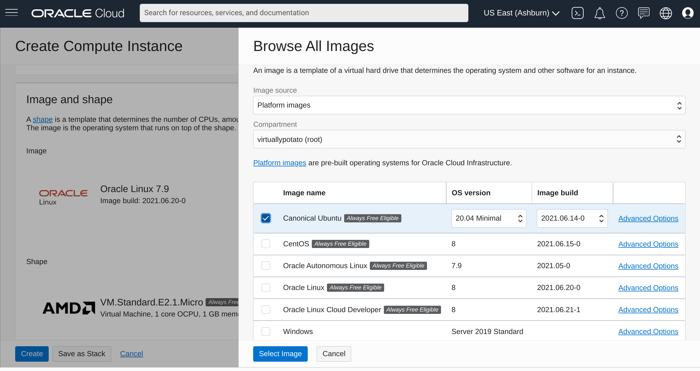
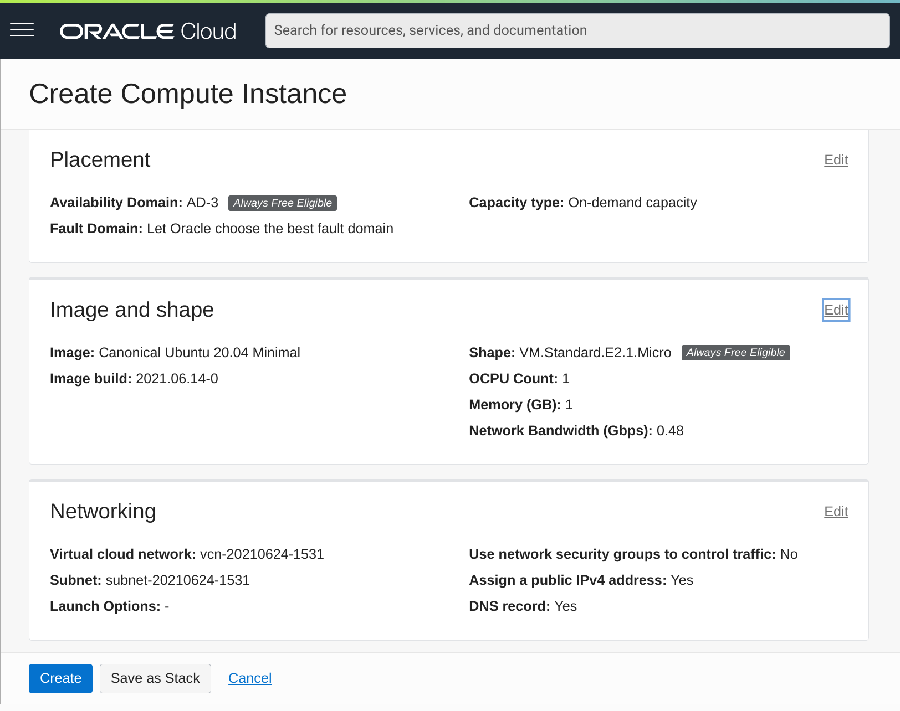
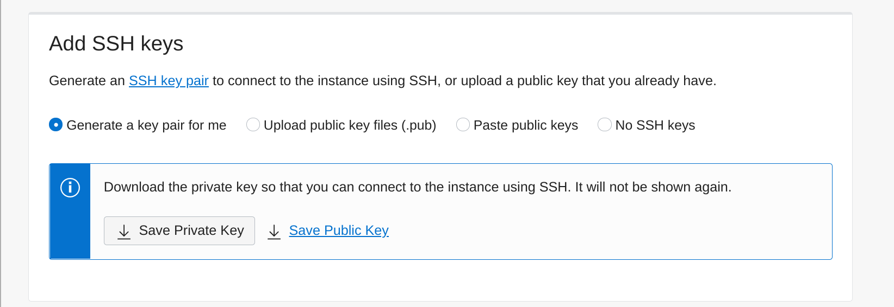
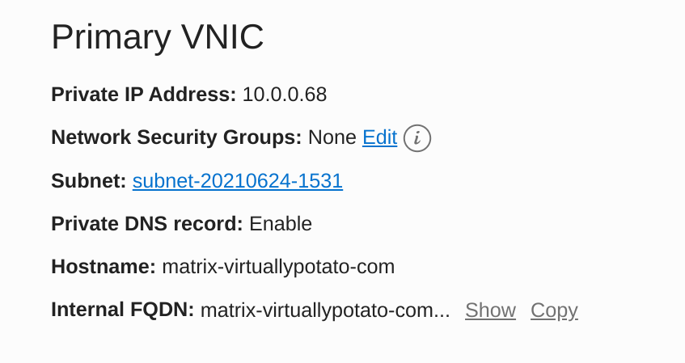
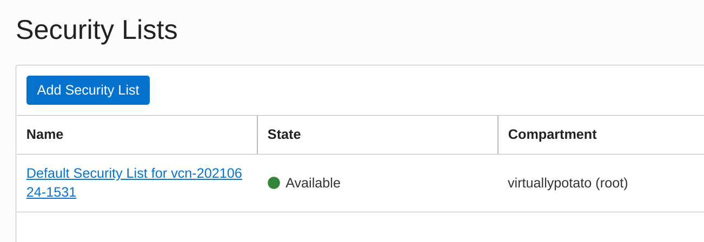
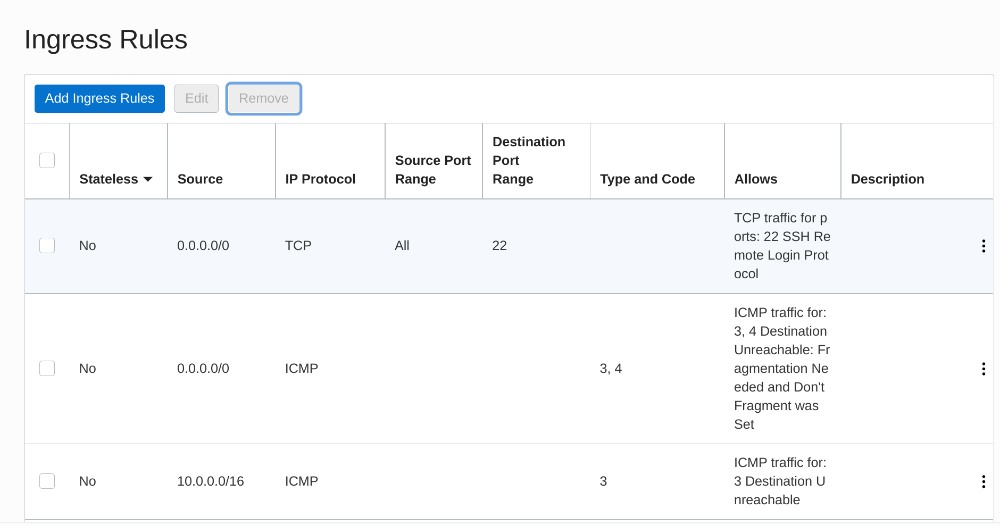
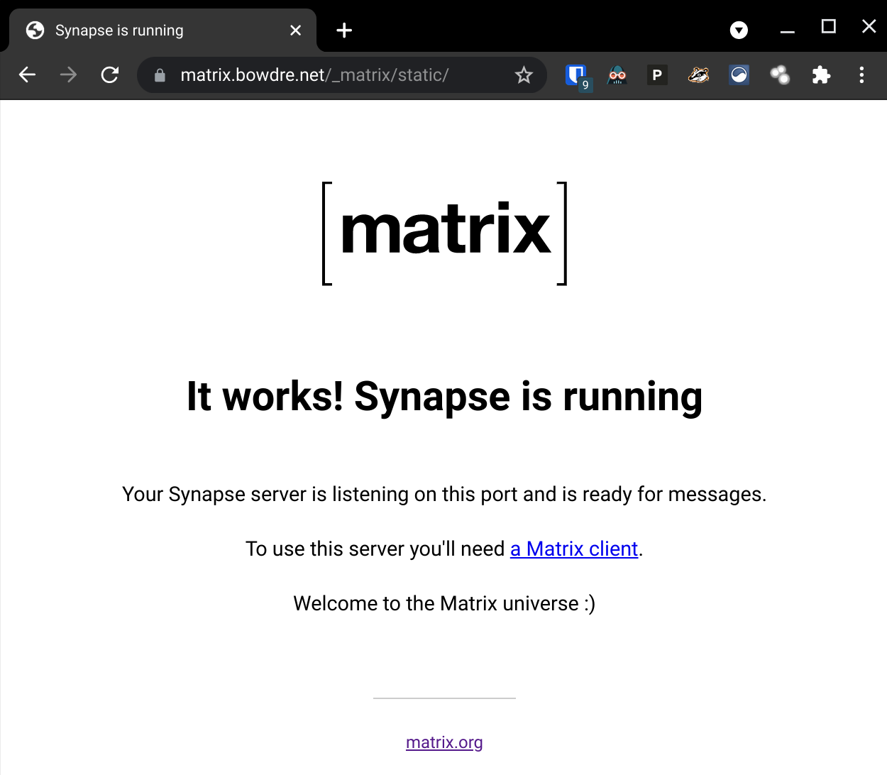
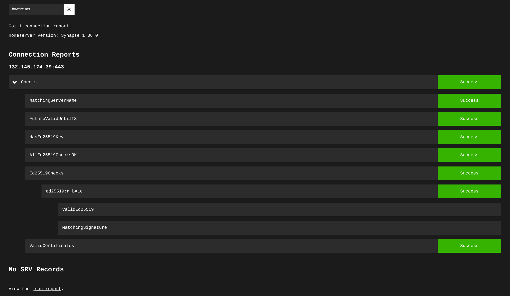
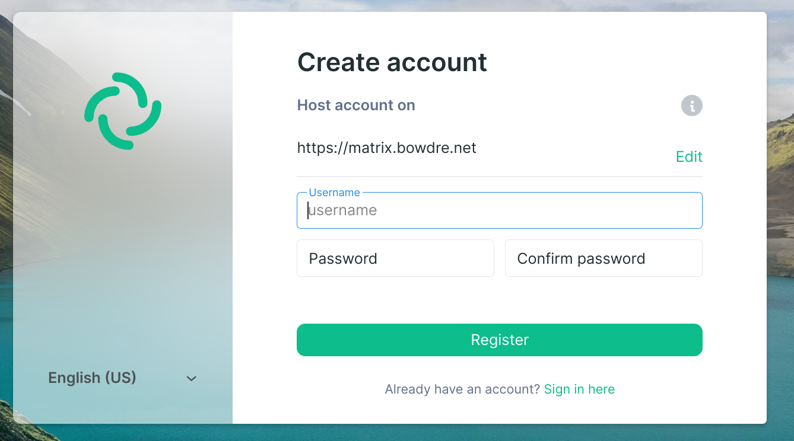

I've heard a lot lately about how generous [Oracle Cloud's free tier](https://www.oracle.com/cloud/free/) is, particularly when [compared with the free offerings](https://github.com/cloudcommunity/Cloud-Service-Providers-Free-Tier-Overview) from other public cloud providers. Signing up for an account was fairly straight-forward, though I did have to wait a few hours for an actual human to call me on an actual telephone to verify my account. Once in, I thought it would be fun to try building my own [Matrix](https://matrix.org/) homeserver to really benefit from the network's decentralized-but-federated model for secure end-to-end encrypted communications. 

There are two primary projects for Matrix homeservers: [Synapse](https://github.com/matrix-org/synapse/) and [Dendrite](https://github.com/matrix-org/dendrite). Dendrite is the newer, more efficient server, but it's not quite feature complete. I'll be using Synapse for my build to make sure that everything works right off the bat, and I will be running the server in a Docker container to make it (relatively) easy to replace if I feel more comfortable about Dendrite in the future.

As usual, it took quite a bit of fumbling about before I got everything working correctly. Here I'll share the steps I used to get up and running.

### Instance creation
Getting a VM spun up on Oracle Cloud was a pretty simple process. I logged into my account, navigated to *Menu -> Compute -> Instances*, and clicked on the big blue **Create Instance** button.


I'll be hosting this for my `bowdre.net` domain, so I start by naming the instance accordingly: `matrix.bowdre.net`. Naming it isn't strictly necessary, but it does help with keeping track of things. The instance defaults to using an Oracle Linux image. I'd rather use an Ubuntu one for this, simply because I was able to find more documentation on getting Synapse going on Debian-based systems. So I hit the **Edit** button next to *Image and Shape*, select the **Change Image** option, pick **Canonical Ubuntu** from the list of available images, and finally click **Select Image** to confirm my choice.


This will be an Ubuntu 20.04 image running on a `VM.Standard.E2.1.Micro` instance, which gets a single AMD EPYC 7551 CPU with 2.0GHz base frequency and 1GB of RAM. It's not much, but it's free - and it should do just fine for this project.

I can leave the rest of the options as their defaults, making sure that the instance will be allotted a public IPv4 address.


Scrolling down a bit to the *Add SSH Keys* section, I leave the default **Generate a key pair for me** option selected, and click the very-important **Save Private Key** button to download the private key to my computer so that I'll be able to connect to the instance via SSH.


Now I can finally click the blue **Create Instance** button at the bottom of the screen, and just wait a few minutes for it to start up. Once the status shows a big green "Running" square, I'm ready to connect! I'll copy the listed public IP and make a note of the default username (`ubuntu`). I can then plug the IP, username, and the private key I downloaded earlier into my SSH client (the [Secure Shell extension](https://chrome.google.com/webstore/detail/secure-shell/iodihamcpbpeioajjeobimgagajmlibd) for Google Chrome since I'm doing this from my Pixelbook), and log in to my new VM in The Cloud.


### DNS setup
According to [Oracle's docs](https://docs.oracle.com/en-us/iaas/Content/Network/Tasks/managingpublicIPs.htm), the public IP assigned to my instance is mine until I terminate the instance. It should even remain assigned if I stop or restart the instance, just as long as I don't delete the virtual NIC attached to it.  So I'll skip the [`ddclient`-based dynamic DNS configuration I've used in the past](/bitwarden-password-manager-self-hosted-on-free-google-cloud-instance#configure-dynamic-dns) and instead go straight to my registrar's DNS management portal and create a new `A` record for `matrix.bowdre.net` with the instance's public IP. 

While I'm managing DNS, it might be good to take a look at the requirements for [federating my new server](https://github.com/matrix-org/synapse/blob/master/docs/federate.md#setting-up-federation) with the other Matrix servers out there. I'd like for users identities on my server to be identified by the `bowdre.net` domain (`@user:bowdre.net`) rather than the full `matrix.bowdre.net` FQDN (`@user:matrix.bowdre.net` is kind of cumbersome). The standard way to do this to leverage [`.well-known` delegation](https://github.com/matrix-org/synapse/blob/master/docs/delegate.md#well-known-delegation), where the URL at `http://bowdre.net/.well-known/matrix/server` would return a JSON structure telling other Matrix servers how to connect to mine:
```json
{
    "m.server": "matrix.bowdre.net:8448"
}
```

I don't *currently* have another server already handling requests to `bowdre.net`, so for now I'll add another `A` record with the same public IP address to my DNS configuration. Requests for both `bowdre.net` and `matrix.bowdre.net` will reach the same server instance, but those requests will be handled differently. More on that later. 

An alternative to this `.well-known` delegation would be to use [`SRV` DNS record delegation](https://github.com/matrix-org/synapse/blob/master/docs/delegate.md#srv-dns-record-delegation) to accomplish the same thing. I'd create an `SRV` record for `_matrix._tcp.bowdre.net` with the data `0 10 8448 matrix.bowdre.net` (priority=`0`, weight=`10`, port=`8448`, target=`matrix.bowdre.net`) which would again let other Matrix servers know where to send the federation traffic for my server. This approach has an advantage of not needing to make any changes on the `bowdre.net` web server, but it would require the delegated `matrix.bowdre.net` server to *also* [return a valid certificate for `bowdre.net`](https://matrix.org/docs/spec/server_server/latest#:~:text=If%20the%20/.well-known%20request%20resulted,present%20a%20valid%20certificate%20for%20%3Chostname%3E.). Trying to get a Let's Encrypt certificate for a server name that doesn't resolve authoritatively in DNS sounds more complicated than I want to get into with this project, so I'll move forward with my plan to use the `.well-known` delegation instead.

But first, I need to make sure that the traffic reaches the server to begin with.

### Firewall configuration
Synapse listens on port `8008` for connections from messaging clients, and typically uses port `8448` for federation traffic from other Matrix servers. Rather than expose those ports directly, I'm going to put Synapse behind a reverse proxy on HTTPS port `443`. I'll also need to allow inbound traffic HTTP port `80` for ACME certificate challenges. I've got two firewalls to contend with: the Oracle Cloud one which blocks traffic from getting into my virtual cloud network, and the host firewall running inside the VM.

I'll tackle the cloud firewall first. From the page showing my instance details, I click on the subnet listed under the *Primary VNIC* heading:


I then look in the *Security Lists* section and click on the Default Security List:


The *Ingress Rules* section lists the existing inbound firewall exceptions, which by default is basically just SSH. I click on **Add Ingress Rules** to create a new one.


I want this to apply to traffic from any source IP so I enter the CIDR `0.0.0.0/0`, and I enter the *Destination Port Range* as `80,443`. I also add a brief description and click **Add Ingress Rules**.


Success! My new ingress rules appear at the bottom of the list. 


That gets traffic from the internet and to my instance, but the OS is still going to drop the traffic at its own firewall. I'll need to work with `iptables` to change that. (You typically use `ufw` to manage firewalls more easily on Ubuntu, but it isn't included on this minimal image and seemed to butt heads with `iptables` when I tried adding it. I eventually decided it was better to just interact with `iptables` directly). I'll start by listing the existing rules on the `INPUT` chain:
```
$ sudo iptables -L INPUT --line-numbers
Chain INPUT (policy ACCEPT)
num  target     prot opt source               destination         
1    ACCEPT     all  --  anywhere             anywhere             state RELATED,ESTABLISHED
2    ACCEPT     icmp --  anywhere             anywhere            
3    ACCEPT     all  --  anywhere             anywhere            
4    ACCEPT     udp  --  anywhere             anywhere             udp spt:ntp
5    ACCEPT     tcp  --  anywhere             anywhere             state NEW tcp dpt:ssh
6    REJECT     all  --  anywhere             anywhere             reject-with icmp-host-prohibited
```

Note the `REJECT all` statement at line `6`. I'll need to insert my new `ACCEPT` rules for ports `80` and `443` above that implicit deny all:
```
sudo iptables -I INPUT 6 -m state --state NEW -p tcp --dport 80 -j ACCEPT
sudo iptables -I INPUT 6 -m state --state NEW -p tcp --dport 443 -j ACCEPT
```

And then I'll confirm that the order is correct:
```
$ sudo iptables -L INPUT --line-numbers
Chain INPUT (policy ACCEPT)
num  target     prot opt source               destination         
1    ACCEPT     all  --  anywhere             anywhere             state RELATED,ESTABLISHED
2    ACCEPT     icmp --  anywhere             anywhere            
3    ACCEPT     all  --  anywhere             anywhere            
4    ACCEPT     udp  --  anywhere             anywhere             udp spt:ntp
5    ACCEPT     tcp  --  anywhere             anywhere             state NEW tcp dpt:ssh
6    ACCEPT     tcp  --  anywhere             anywhere             state NEW tcp dpt:https
7    ACCEPT     tcp  --  anywhere             anywhere             state NEW tcp dpt:http
8    REJECT     all  --  anywhere             anywhere             reject-with icmp-host-prohibited
```

I can use `nmap` running from my local Linux environment to confirm that I can now reach those ports on the VM. (They're still "closed" since nothing is listening on the ports yet, but the connections aren't being rejected.)
```
$ nmap -Pn matrix.bowdre.net
Starting Nmap 7.70 ( https://nmap.org ) at 2021-06-27 12:49 CDT
Nmap scan report for matrix.bowdre.net(150.136.6.180)
Host is up (0.086s latency).
Other addresses for matrix.bowdre.net (not scanned): 2607:7700:0:1d:0:1:9688:6b4
Not shown: 997 filtered ports
PORT    STATE  SERVICE
22/tcp  open   ssh
80/tcp  closed http
443/tcp closed https

Nmap done: 1 IP address (1 host up) scanned in 8.44 seconds
```

Cool! Before I move on, I'll be sure to make the rules persistent so they'll be re-applied whenever `iptables` starts up:

Make rules persistent:
```
$ sudo netfilter-persistent save
run-parts: executing /usr/share/netfilter-persistent/plugins.d/15-ip4tables save
run-parts: executing /usr/share/netfilter-persistent/plugins.d/25-ip6tables save
```

### Reverse proxy setup
I had initially planned on using `certbot` to generate Let's Encrypt certificates, and then reference the certs as needed from an `nginx` or Apache reverse proxy configuration. While researching how the [proxy would need to be configured to front Synapse](https://github.com/matrix-org/synapse/blob/master/docs/reverse_proxy.md), I found this sample `nginx` configuration:
```conf
server {
    listen 443 ssl http2;
    listen [::]:443 ssl http2;

    # For the federation port
    listen 8448 ssl http2 default_server;
    listen [::]:8448 ssl http2 default_server;

    server_name matrix.example.com;

    location ~* ^(\/_matrix|\/_synapse\/client) {
        proxy_pass http://localhost:8008;
        proxy_set_header X-Forwarded-For $remote_addr;
        proxy_set_header X-Forwarded-Proto $scheme;
        proxy_set_header Host $host;

        # Nginx by default only allows file uploads up to 1M in size
        # Increase client_max_body_size to match max_upload_size defined in homeserver.yaml
        client_max_body_size 50M;
    }
}
```

And this sample Apache one:
```conf
<VirtualHost *:443>
    SSLEngine on
    ServerName matrix.example.com

    RequestHeader set "X-Forwarded-Proto" expr=%{REQUEST_SCHEME}
    AllowEncodedSlashes NoDecode
    ProxyPreserveHost on
    ProxyPass /_matrix http://127.0.0.1:8008/_matrix nocanon
    ProxyPassReverse /_matrix http://127.0.0.1:8008/_matrix
    ProxyPass /_synapse/client http://127.0.0.1:8008/_synapse/client nocanon
    ProxyPassReverse /_synapse/client http://127.0.0.1:8008/_synapse/client
</VirtualHost>

<VirtualHost *:8448>
    SSLEngine on
    ServerName example.com

    RequestHeader set "X-Forwarded-Proto" expr=%{REQUEST_SCHEME}
    AllowEncodedSlashes NoDecode
    ProxyPass /_matrix http://127.0.0.1:8008/_matrix nocanon
    ProxyPassReverse /_matrix http://127.0.0.1:8008/_matrix
</VirtualHost>
```

I also found this sample config for another web server called [Caddy](https://caddyserver.com):
```
matrix.example.com {
  reverse_proxy /_matrix/* http://localhost:8008
  reverse_proxy /_synapse/client/* http://localhost:8008
}

example.com:8448 {
  reverse_proxy http://localhost:8008
}
```

One of these looks much simpler than the other two. I'd never heard of Caddy so I did some quick digging, and I found that it would actually [handle the certificates entirely automatically](https://caddyserver.com/docs/automatic-https) - in addition to having a much easier config. [Installing Caddy](https://caddyserver.com/docs/install#debian-ubuntu-raspbian) wasn't too bad, either:

```sh
sudo apt install -y debian-keyring debian-archive-keyring apt-transport-https
curl -1sLf 'https://dl.cloudsmith.io/public/caddy/stable/gpg.key' | sudo apt-key add -
curl -1sLf 'https://dl.cloudsmith.io/public/caddy/stable/debian.deb.txt' | sudo tee /etc/apt/sources.list.d/caddy-stable.list
sudo apt update
sudo apt install caddy
```

Then I just need to put my configuration into the default `Caddyfile`, including the required `.well-known` delegation piece from earlier. 
```
$ sudo vi /etc/caddy/Caddyfile
matrix.bowdre.net {
        reverse_proxy /_matrix/* http://localhost:8008
        reverse_proxy /_synapse/client/* http://localhost:8008
}

bowdre.net {
        route {
                respond /.well-known/matrix/server `{"m.server": "matrix.bowdre.net:443"}`
                redir https://virtuallypotato.com
        }
}
```
There's a lot happening in that 11-line `Caddyfile`, but it's not complicated by any means. The `matrix.bowdre.net` section is pretty much exactly yanked from the sample config, and it's going to pass any requests that start like `matrix.bowdre.net/_matrix/` or `matrix.bowdre.net/_synapse/client/` through to the Synapse server listening locally on port `8008`. Caddy will automatically request and apply a Let's Encrypt or ZeroSSL cert for any server names spelled out in the config - very slick!

I set up the `bowdre.net` section to return the appropriate JSON string to tell other Matrix servers to connect to `matrix.bowdre.net` on port `443` (so that I don't have to open port `8448` through the firewalls), and to redirect all other traffic to one of my favorite technical blogs (maybe you've heard of it?). I had to wrap the `respond` and `redir`  directives in a [`route { }` block](https://caddyserver.com/docs/caddyfile/directives/route) because otherwise Caddy's [implicit precedence](https://caddyserver.com/docs/caddyfile/directives#directive-order) would execute the redirect for *all* traffic and never hand out the necessary `.well-known` data.

(I wouldn't need that section at all if I were using a separate web server for `bowdre.net`; instead, I'd basically just add that `respond /.well-known/matrix/server` line to that other server's config.)

Now to enable the `caddy` service, start it, and restart it so that it loads the new config:
```
sudo systemctl enable caddy
sudo systemctl start caddy
sudo systemctl restart caddy
```

If I repeat my `nmap` scan from earlier, I'll see that the HTTP and HTTPS ports are now open. The server still isn't actually serving anything on those ports yet, but at least it's listening.
```
$ nmap -Pn matrix.bowdre.net
Starting Nmap 7.70 ( https://nmap.org ) at 2021-06-27 13:44 CDT
Nmap scan report for matrix.bowdre.net (150.136.6.180)
Host is up (0.034s latency).
Not shown: 997 filtered ports
PORT    STATE SERVICE
22/tcp  open  ssh
80/tcp  open  http
443/tcp open  https

Nmap done: 1 IP address (1 host up) scanned in 5.29 seconds
```

Browsing to `https://matrix.bowdre.net` shows a blank page - but a valid and trusted certificate that I did absolutely nothing to configure!


The `.well-known` URL also returns the expected JSON:


And trying to hit anything else at `https://bowdre.net` brings me right back here. 

And again, the config to do all this (including getting valid certs for two server names!) is just 11 lines long. Caddy is seriously and magically cool.

Okay, let's actually serve something up now.

### Synapse installation
#### Docker setup
Before I can get on with [deploying Synapse in Docker](https://hub.docker.com/r/matrixdotorg/synapse), I first need to [install Docker](https://docs.docker.com/engine/install/ubuntu/#install-using-the-repository) on the system:

```sh
sudo apt-get install \
    apt-transport-https \
    ca-certificates \
    curl \
    gnupg \
    lsb-release

curl -fsSL https://download.docker.com/linux/ubuntu/gpg | sudo gpg --dearmor -o /usr/share/keyrings/docker-archive-keyring.gpg

echo \
  "deb [arch=amd64 signed-by=/usr/share/keyrings/docker-archive-keyring.gpg] https://download.docker.com/linux/ubuntu \
  $(lsb_release -cs) stable" | sudo tee /etc/apt/sources.list.d/docker.list > /dev/null

sudo apt update

sudo apt install docker-ce docker-ce-cli containerd.io
```

I'll also [install Docker Compose](https://docs.docker.com/compose/install/#install-compose):
```sh
sudo curl -L "https://github.com/docker/compose/releases/download/1.29.2/docker-compose-$(uname -s)-$(uname -m)" -o /usr/local/bin/docker-compose

sudo chmod +x /usr/local/bin/docker-compose
```

And I'll add my `ubuntu` user to the `docker` group so that I won't have to run every docker command with `sudo`:
```
sudo usermod -G docker -a ubuntu
```

I'll log out and back in so that the membership change takes effect, and then test both `docker` and `docker-compose` to make sure they're working:
```
$ docker --version
Docker version 20.10.7, build f0df350

$ docker-compose --version
docker-compose version 1.29.2, build 5becea4c
```

#### Synapse setup
Now I'll make a place for the Synapse installation to live, including a `data` folder that will be mounted into the container:
```
sudo mkdir -p /opt/matrix/synapse/data
cd /opt/matrix/synapse
```

And then I'll create the compose file to define the deployment:
```yaml
$ sudo vi docker-compose.yml
services:
  synapse:
    container_name: "synapse"
    image: "matrixdotorg/synapse"
    restart: "unless-stopped"
    ports:
      - "127.0.0.1:8008:8008"
    volumes:
      - "./data/:/data/"
```

Before I can fire this up, I'll need to generate an initial configuration as [described in the documentation](https://hub.docker.com/r/matrixdotorg/synapse). Here I'll specify the server name that I'd like other Matrix servers to know mine by (`bowdre.net`):

```sh
$ docker run -it --rm \
    -v "/opt/matrix/synapse/data:/data" \
    -e SYNAPSE_SERVER_NAME=bowdre.net \
    -e SYNAPSE_REPORT_STATS=yes \
    matrixdotorg/synapse generate

Unable to find image 'matrixdotorg/synapse:latest' locally
latest: Pulling from matrixdotorg/synapse
69692152171a: Pull complete 
66a3c154490a: Pull complete 
3e35bdfb65b2: Pull complete 
f2c4c4355073: Pull complete 
65d67526c337: Pull complete 
5186d323ad7f: Pull complete 
436afe4e6bba: Pull complete 
c099b298f773: Pull complete 
50b871f28549: Pull complete 
Digest: sha256:5ccac6349f639367fcf79490ed5c2377f56039ceb622641d196574278ed99b74
Status: Downloaded newer image for matrixdotorg/synapse:latest
Creating log config /data/bowdre.net.log.config
Generating config file /data/homeserver.yaml
Generating signing key file /data/bowdre.net.signing.key
A config file has been generated in '/data/homeserver.yaml' for server name 'bowdre.net'. Please review this file and customise it to your needs.
```

As instructed, I'll use `sudo vi data/homeserver.yaml` to review/modify the generated config. I'll leave
```yaml
server_name: "bowdre.net"
```
since that's how I'd like other servers to know my server, and I'll uncomment/edit in:
```yaml
public_baseurl: https://matrix.bowdre.net
```
since that's what users (namely, me) will put into their Matrix clients to connect.

And for now, I'll temporarily set:
```yaml
enable_registration: true
```
so that I can create a user account without fumbling with the CLI. I'll be sure to set `enable_registration: false` again once I've registered the account(s) I need to have on my server. The instance has limited resources so it's probably not a great idea to let just anybody create an account on it.

There are a bunch of other useful configurations that can be made here, but these will do to get things going for now.

Time to start it up:
```
$ docker-compose up -d
Creating network "synapse_default" with the default driver
Creating synapse ... done
```

And use `docker ps` to confirm that it's running:
```
$ docker ps
CONTAINER ID   IMAGE                  COMMAND       CREATED          STATUS                    PORTS                                          NAMES
573612ec5735   matrixdotorg/synapse   "/start.py"   25 seconds ago   Up 23 seconds (healthy)   8009/tcp, 127.0.0.1:8008->8008/tcp, 8448/tcp   synapse
```

### Testing
And I can point my browser to `https://matrix.bowdre.net/_matrix/static/` and see the Matrix landing page:


Before I start trying to connect with a client, I'm going to plug the server address in to the [Matrix Federation Tester](https://federationtester.matrix.org/) to make sure that other servers will be able to talk to it without any problems:


And I can view the JSON report at the bottom of the page to confirm that it's correctly pulling my `.well-known` delegation:
```json
{
  "WellKnownResult": {
    "m.server": "matrix.bowdre.net:443",
    "CacheExpiresAt": 0
  },
```

Now I can fire up my [Matrix client of choice](https://element.io/get-started)), specify my homeserver using its full FQDN, and [register](https://app.element.io/#/register) a new user account:


(Once my account gets created, I go back to edit `/opt/matrix/synapse/data/homeserver.yaml` again and set `enable_registration: false`, then fire a `docker-compose restart` command to restart the Synapse container.)

### Wrap-up
And that's it! I now have my own Matrix server, and I can use my new account for secure chats with Matrix users on any other federated homeserver. It works really well for directly messaging other individuals, and also for participating in small group chats. The server *does* kind of fall on its face if I try to join a massively-populated (like 500+ users) room, but I'm not going to complain about that too much on a free-tier server.

All in, I'm pretty pleased with how this little project turned out, and I learned quite a bit along the way. I'm tremendously impressed by Caddy's power and simplicity, and I look forward to using it more in future projects. 

If you're on Matrix, hit me up: **[@john:bowdre.net](https://matrix.to/#/@john:bowdre.net)**

### Update: Updating
After a while, it's probably a good idea to update both the Ubntu server and the Synapse container running on it. Updating the server itself is as easy as:
```sh
sudo apt update
sudo apt upgrade
# And, if needed:
sudo reboot
```

Here's what I do to update the container:
```sh
# Move to the working directory
cd /opt/matrix/synapse
# Pull a new version of the synapse image
docker-compose pull
# Stop the container
docker-compose down
# Start it back up without the old version
docker-compose up -d --remove-orphans
# Periodically remove the old docker images
docker image prune
```
