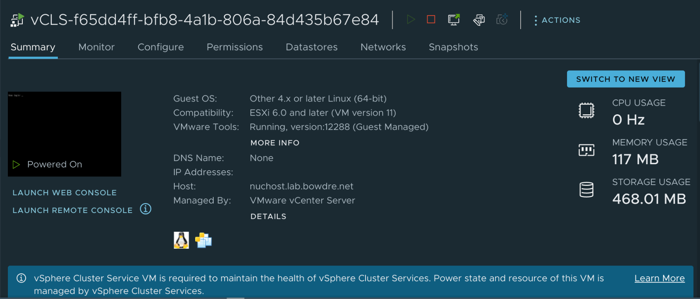

Way back in 2020, VMware released vSphere 7 Update 1 and introduced the new [vSphere Clustering Services (vCLS)](https://core.vmware.com/resource/introduction-vsphere-clustering-service-vcls) to improve how cluster services like the Distributed Resource Scheduler (DRS) operate. vCLS deploys lightweight agent VMs directly on the cluster being managed, and those VMs provide a decoupled and distributed control plane to offload some of the management responsibilities from the vCenter server. 

That's very cool, particularly in large continent-spanning environments or those which reach into multiple clouds, but it may not make sense to add those additional workloads in resource-constrained homelabs. And while the vCLS VMs are supposed to be automagically self-managed, sometimes things go a little wonky and that management fails to function correctly, which can negatively impact DRS.

