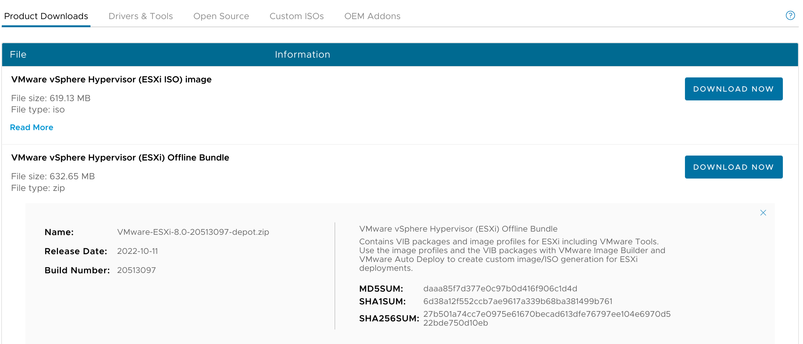
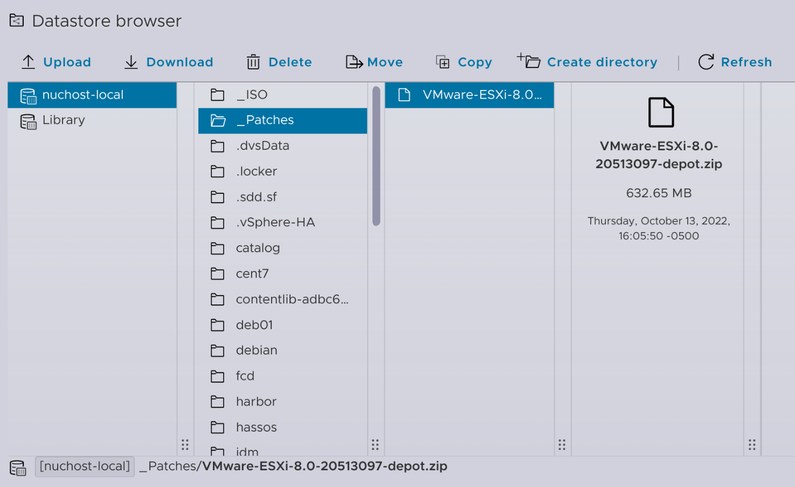

You may have heard that there's a new vSphere release out in the wild - [vSphere 8, which just reached Initial Availability this week](https://advocacy.vmware.com/Article/Redirect/9cfbc1b1-207f-4885-a520-cc0bfafcd6c0?uc=197618&g=2d17264e-593a-492d-8d91-3a2155e835f1&f=3104867). Upgrading the vCenter in my single-host homelab is a very straightforward task, and using the included Lifecycle Manager would make quick work of patching a cluster of hosts... but things get a little trickier with a single host. I could write the installer ISO to a USB drive, boot the host off of that, and go through the install interactively, but what if physical access to the host is kind of inconvenient?

The other option for upgrading a host is using the `esxcli` command to apply an update from an offline bundle. It's a pretty easy solution (and can even be done remotely, such as when connected to [my homelab](/vmware-home-lab-on-intel-nuc-9) via the [Tailscale node running on my Quartz64 ESXi-ARM host](/esxi-arm-on-quartz64/#installing-tailscale)) *but I always forget the commands.*

So here's quick note on how I upgraded my lone ESXi to the new ESXi 8 IA release so that maybe I'll remember how to do it next time and won't have to go [Neeva](https://neeva.com)'ing for the answer again.

### 0: Download the offline bundle
Downloading the Offline Bundle from [VMware Customer Connect](https://customerconnect.vmware.com/downloads/details?downloadGroup=ESXI800&productId=1345&rPId=95214) yields a file named `VMware-ESXi-8.0-20513097-depot.zip`.



### 1: Transfer the bundle to the host
I've found that the easiest way to do this it to copy it to a datastore which is accessible from the host.


### 2. Power down VMs
The host will need to be in maintenance mode in order to apply the upgrade, and since it's a standalone host it won't enter maintenance mode until all of its VMs have been stopped. This can be easily accomplished through the ESXi embedded host client. 

### 3. Place host in maintenance mode
I can do that by SSH'ing to the host and running:
```shell
esxcli system maintenanceMode set -e true
```

And can confirm that it happened with:
```shell
esxcli system maintenanceMode get
Enabled
```

### 4. Identify the profile name
Because this is an *upgrade* from one major release to another rather than a simple *update*, I need to know the name of the profile which will be applied. I can identify that with:
```shell
esxcli software sources profile list -d /vmfs/volumes/nuchost-local/_Patches/VMware-ESXi-8.0-20513097-depot.zip
Name                          Vendor        Acceptance Level  Creation Time        Modification Time
----------------------------  ------------  ----------------  -------------------  -----------------
ESXi-8.0.0-20513097-standard  VMware, Inc.  PartnerSupported  2022-09-23T18:59:28  2022-09-23T18:59:28
ESXi-8.0.0-20513097-no-tools  VMware, Inc.  PartnerSupported  2022-09-23T18:59:28  2022-09-23T18:59:28
```
{}
When using the `esxcli` command to install software/updates, it's important to use absolute paths rather than relative paths. Otherwise you'll get errors and wind up chasing your tail for a while.
{}

In this case, I'll use the `ESXi-8.0.0-20513097-standard` profile.

### 5. Install the upgrade
Now for the moment of truth:
```shell
esxcli software profile update -d /vmfs/volumes/nuchost-local/_Patches/VMware-ESXi-8.0-2051309
7-depot.zip -p ESXi-8.0.0-20513097-standard
```

When it finishes (successfully), it leaves a little message that the update won't be complete until the host is rebooted, so I'll go ahead and do that as well:
```shell
reboot
```

And then wait (oh-so-patiently) for the host to come back up.

